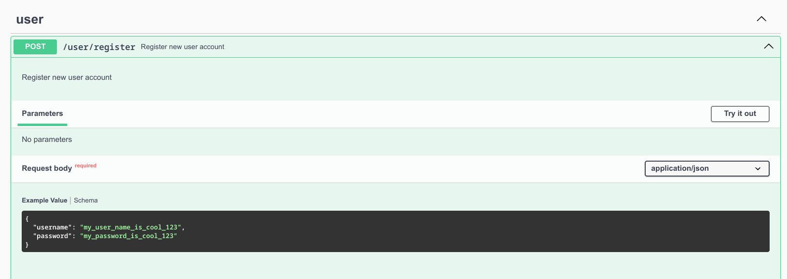
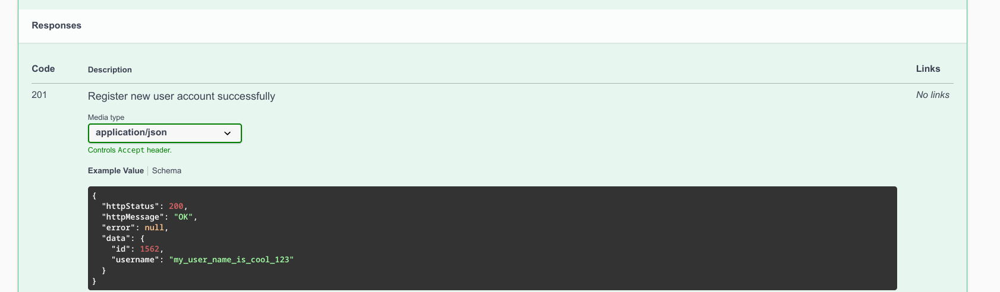
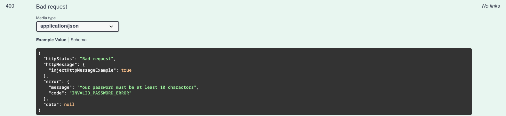

# class-to-swagger-schema

A very helpul and light weigh package for mapping Typescript class to Swagger Schema

Author: chabuuuu (a.k.a haphuthinh)

- [Installation](#computer-installation)
- [Usage](#usage)
- [Class property decorator](#class-property-decorator)
  - [@SwaggerProperty](#swaggerproperty)
  - [@SwaggerExample](#swaggerexample)
- [Inject property](#inject-property)
  - [injectClassHere](#injectclasshere)
  - [injectHttpStatusExample](#injecthttpstatusexample)
  - [injectHttpMessageExample](#injecthttpmessageexample)
- [Other schema type (totally 8 schema type)](#other-schema-type-totally-8-schema-type)
  - [Create success response schema](#create-success-response-schema)
  - [Error schema](#error-schema)
  - [Update success response schema](#update-success-response-schema)
  - [Delete success response](#delete-success-response)
  - [Find one response schema](#find-one-response-schema)
  - [Find many response schema](#find-many-response-schema)
  - [Find many (with paging) response schema](#find-many-with-paging-response-schema)
  - [Create success response schema](#usage)

## :computer: Installation

```
npm i class-to-swagger-schema
```

## Usage

Example that I have a DTO class that describe request body
for resgiter new user, I want to inject this class to the swagger schema

```
class RegisterUserRequestDto {
@SwaggerProperty("Username of user")
@SwaggerExample("my_username_is_cool_123")
username!: string;

@SwaggerProperty("Password of user")
@SwaggerExample("my_password_is_cool_123")
password!: string;
}
```

First, I need to create a base schema for all request body to reuse it

```
export const requestBodySchema = {
  type: "object",
  properties: {
    /**
     ** Add this if you want to inject your class here
     */
    injectClassHere: true,
  },
};
```

The base schema will have the same format of general Swagger schema in Json type.

In the example above, we add <injectClassHere: true> to anywhere we want to inject the Typescript class to it

In this example, the package will inject the RegisterUserRequestDto to it, the result when convert to Swagger Schema will look like this:

```
    components:
      schemas:
        type: "object",
            properties:
                username:
                    type: "string"
                    description: "Username of user"
                    example: "my_username_is_cool_123"
                password:
                    type: "string"
                    description: "Password of user"
                    example: "my_password_is_cool_123"
```

But you dont need to worry about the swagger yaml format anymore, let check below

```
import {
  SwaggerExample,
  SwaggerProperty,
  swaggerSchemaGenerator,
} from "class-to-swagger-schema";

const testRequestBody = swaggerSchemaGenerator.generateRequestBody(RegisterUserRequestDto);

```

The above will auto generate the swagger schema for you

Then you just need to map it to your swagger schema define as below

```
export const swaggerSchemaMapping = {

RegisterRequestBodyDto: testRequestBody,

};
```

//Finally, you can use the swaggerSchemaMapping to inject to the swagger schema in swagger option:

```
const options = {
  definition: {
    openapi: "3.1.0",
    info: {
      title: "ExpressJS Super Clean Base Source API Documentation",
      version: "0.1.0",
      description:
        "This is API application made with Express and documented with Swagger",
      license: {
        name: "MIT",
        url: "https://spdx.org/licenses/MIT.html",
      },
      contact: {
        name: "Thinh Ha",
        email: "haphuthinh332004@gmail.com",
      },
    },
    servers: [],
    components: {
      schemas: swaggerSchemaMapping, //Inject the schema mapping here
    },
  },
  apis: ["./controllers/*.ts"],
};
```

Then, you just need to use the mapped schema normally using normal package swagger-ui-express:

```
export class UserController {
  /**
   * @openapi
   * /user/register:
   *   post:
   *     tags:
   *       - user
   *     summary: Register new user account
   *     description: Register new user account
   *     requestBody:
   *       required: true
   *       content:
   *         application/json:
   *           schema:
   *             $ref: '#/components/schemas/RegisterRequestBodyDto'
   */
  async registerUser(req: any, res: any, next: any) {}
}
```

The result will as below:



## Class property decorator

### @SwaggerProperty

This will define that the folow property in class that have this decorator will be show in Swagger schema

Usage:

```
class TestDto {

    @SwaggerProperty("The id of user") //This will add the description for the property when convert to swagger schema
    id!: string

    @SwaggerProperty()
    password!: string
}
```

### @SwaggerExample

This will generate example for the folow property in swagger schema

```
class TestDto {

    @SwaggerProperty()
    @SwaggerExample("my_password") //This will show example as "my_password" in Swagger schema
    password!: string
}
```

## Inject property

### injectClassHere

This mark that the object that this will be replace with the class you inject:

```
export const requestBodySchema = {
  type: "object",
  properties: {
    /**
     ** Add this if you want to inject your class here
     */
    injectClassHere: true,
  },
};

```

Then do this:

```
swaggerSchemaGenerator.setRequestBodySchema(requestBodySchema);

const testRequestBody = swaggerSchemaGenerator.generateRequestBody(
  RegisterUserRequestDto
);

/*
 value of testRequestBody =
    components:
      schemas:
        type: "object",
            properties:
                username:
                    type: "string"
                    description: "Username of user"
                    example: "my_username_is_cool_123"
                password:
                    type: "string"
                    description: "Password of user"
                    example: "my_password_is_cool_123"
*/
```

### injectHttpStatusExample

This mark that the object that this will be replace with the class you inject:

```
export const errorSchema = {
  type: "object",
    httpStatus: {
      type: "integer",
      description: "HTTP status code",
      example: {
        /**
         ** Add this if you want to inject http status example here
         */
        injectHttpStatusExample: true,
      },
    },
};

```

Then do this:

```
swaggerSchemaGenerator.setErrorResponseSchema(errorSchema);


const testError = swaggerSchemaGenerator.generateErrorResponse(
  "",
  null,
  400, //The status code you want to inject
  null,
);

As a result, this will inject the status code: 400 to the

/*
 value of testError =
    components:
      schemas:
        type: "object",
            properties:
                httpStatus:
                    type: "integer"
                    description: "HTTP status code"
                    example: "400"
*/
```

### injectHttpMessageExample

This mark that the object that this will be replace with the class you inject:

```
export const errorSchema = {
  type: "object",
    httpMessage: {
      type: "string",
      description: "HTTP status message",
      example: {
        /**
         ** Add this if you want to inject http message example here
         */
        injectHttpMessageExample: true,
      },
    },
};

```

Then do this:

```
swaggerSchemaGenerator.setErrorResponseSchema(errorSchema);


const testError = swaggerSchemaGenerator.generateErrorResponse(
  "",
  null,
  null,
  "Bad request", //The status message you want to inject (optional)
);

As a result, this will inject the http message: "Bad request" to the

/*
 value of testError =
    components:
      schemas:
        type: "object",
            properties:
                httpMessage:
                    type: "string"
                    description: "HTTP status message"
                    example: ""Bad request""
*/
```

## Other schema type (totally 8 schema type)

### Create success response schema

First init create success response schema:

```
export const createSuccessResponseSchema = {
  type: "object",
  properties: {
    httpStatus: {
      type: "integer",
      description: "HTTP status code",
      example: "201",
    },
    httpMessage: {
      type: "string",
      description: "HTTP status message",
      example: "Created",
    },
    error: {
      type: "object",
      description: "Error response",
      example: null,
    },
    data: {
      type: "object",
      description: "Data response",
      properties: {
        /**
         ** Add this if you want to inject your class here
         */
        injectClassHere: true,
      },
    },
  },
};

swaggerSchemaGenerator.setCreateSuccessResponseSchema(
  createSuccessResponseSchema
);
```

I have a DTO class that describe the response when register new user successfully:

```
class RegisterUserResponseDto {
@SwaggerProperty("Id of user")
@SwaggerExample("1562")
id!: number;

@SwaggerProperty("Username of user")
@SwaggerExample("my_user_name_is_cool_123")
username!: string;
}
```

Finally, convert the dto to schema:

```
const testCreate = swaggerSchemaGenerator.generateCreateSuccessResponse(
RegisterUserResponseDto
);
```

The result will as below:



### Error schema

First, we need to create a base error schema

```
export const errorResponseSchema = {
  type: "object",
  properties: {
    httpStatus: {
      type: "integer",
      description: "HTTP status code",
      example: {
        /**
         ** Add this if you want to inject http status example here
         */
        injectHttpStatusExample: true,
      },
    },
    httpMessage: {
      type: "string",
      description: "HTTP status message",
      example: {
        /**
         ** Add this if you want to inject http message example here
         */
        injectHttpMessageExample: true,
      },
    },
    error: {
      type: "object",
      description: "Error response",
      properties: {
        /**
         ** Add this if you want to inject your class here
         */
        injectClassHere: true,
      },
    },
    data: {
      type: "object",
      description: "Data response",
      example: null,
    },
  },
};
```

Example that I want to generate schema for the error response when register new user:
User provide invalid password, http status code is 400,
custom error code is INVALID_PASSWORD_ERROR, I want to inject this error to the swagger schema

```
const testError = swaggerSchemaGenerator.generateErrorResponse(
"Your password must be at least 10 charactors", //The error message you want to inject (required)
"INVALID_PASSWORD_ERROR", //The error code you want to inject (optional)
400, //The status code you want to inject (optional)
"Bad request" //The status message you want to inject (optional)
);
```

Next, I need to mapping the schema above to the swagger schema

```
export const swaggerSchemaMapping = {

RegisterSuccessResponseDto: testCreate,

Register_INVALID_PASSWORD_ERROR: testError, //Add new map
};
```

The result will as below:


### Update success response schema

Example that I want to generate schema for the update success response

Create base update success response:

```
export const updateSuccessResponseSchema = {
  type: "object",
  properties: {
    httpStatus: {
      type: "integer",
      description: "HTTP status code",
      example: "200",
    },
    httpMessage: {
      type: "string",
      description: "HTTP status message",
      example: "OK",
    },
    error: {
      type: "object",
      description: "Error response",
      example: null,
    },
    data: {
      type: "object",
      description: "Data response",
      properties: {
        message: {
          type: "string",
          description: "Message",
          example: "Updated successfully",
        },
      },
    },
  },
};


swaggerSchemaGenerator.setUpdateSuccessResponseSchema(
  updateSuccessResponseSchema
);
```

Next, convert and mapping

```
const testUpdate = swaggerSchemaGenerator.generateUpdateSuccessResponse();
```

### Delete success response

Example that I want to generate schema for the delete success response

First, create delete success base schema:

```
export const deleteSuccessResponseSchema = {
  type: "object",
  properties: {
    httpStatus: {
      type: "integer",
      description: "HTTP status code",
      example: "200",
    },
    httpMessage: {
      type: "string",
      description: "HTTP status message",
      example: "OK",
    },
    error: {
      type: "object",
      description: "Error response",
      example: null,
    },
    data: {
      type: "object",
      description: "Data response",
      properties: {
        message: {
          type: "string",
          description: "Message",
          example: "Deleted successfully",
        },
      },
    },
  },
};

swaggerSchemaGenerator.setDeleteSuccessResponseSchema(
  deleteSuccessResponseSchema
);
```

```
const testDelete = swaggerSchemaGenerator.generateDeleteSuccessResponse();

```

### Find one response schema

Example that I want to generate schema for the find one response

First, create base find one success response schema:

```
export const findOneResponseSchema = {
  type: "object",
  properties: {
    httpStatus: {
      type: "integer",
      description: "HTTP status code",
      example: "200",
    },
    httpMessage: {
      type: "string",
      description: "HTTP status message",
      example: "OK",
    },
    error: {
      type: "object",
      description: "Error response",
      example: null,
    },
    data: {
      type: "object",
      description: "Data response",
      properties: {
        /**
         ** Add this if you want to inject your class here
         */
        injectClassHere: true,
      },
    },
  },
};

swaggerSchemaGenerator.setFindOneResponseSchema(findOneResponseSchema);
```

Convert as folow:

```
class ExampleDto {
@SwaggerProperty()
example!: string;
}

const testFindOne = swaggerSchemaGenerator.generateFindOneResponse(ExampleDto);
```

### Find many response schema

Example that I want to generate schema for the find many response

Create base find many response schema:

```
export const findManyResponseSchema = {
  type: "object",
  properties: {
    httpStatus: {
      type: "integer",
      description: "HTTP status code",
      example: "200",
    },
    httpMessage: {
      type: "string",
      description: "HTTP status message",
      example: "OK",
    },
    error: {
      type: "object",
      description: "Error response",
      example: null,
    },
    data: {
      type: "array",
      description: "Data response",
      items: {
        type: "object",
        properties: {
          /**
           ** Add this if you want to inject your class here
           */
          injectClassHere: true,
        },
      },
    },
  },
};

swaggerSchemaGenerator.setFindManyResponseSchema(findManyResponseSchema);
```

Convert as below:

```
class ExampleDto {
@SwaggerProperty()
example!: string;
}

const testFindMany =
swaggerSchemaGenerator.generateFindManyResponse(ExampleDto);
```

### Find many (with paging) response schema

Example that I want to generate schema for the find many paging response

First create find many (with paging) response schema:

```
export const findManyPagingResponseSchema = {
  type: "object",
  properties: {
    httpStatus: {
      type: "integer",
      description: "HTTP status code",
      example: "200",
    },
    httpMessage: {
      type: "string",
      description: "HTTP status message",
      example: "OK",
    },
    error: {
      type: "object",
      description: "Error response",
      example: null,
    },
    data: {
      type: "object",
      description: "Paging response",
      properties: {
        records: {
          type: "integer",
          description: "Total records",
          example: 20,
        },
        items: {
          type: "array",
          description: "Item response",
          items: {
            type: "object",
            properties: {
              /**
               ** Add this if you want to inject your class here
               */
              injectClassHere: true,
            },
          },
        },
        pages: {
          type: "integer",
          description: "Total pages",
          example: 2,
        },
        page: {
          type: "integer",
          description: "Current page",
          example: 1,
        },
        recordFrom: {
          type: "integer",
          description: "Record from",
          example: 1,
        },
        recordTo: {
          type: "integer",
          description: "Record to",
          example: 10,
        },
      },
    },
  },
};

swaggerSchemaGenerator.setFindManyPagingResponseSchema(
  findManyPagingResponseSchema
);
```

Convert as below:

```
class ExampleDto {
@SwaggerProperty()
example!: string;
}

const testFindManyPaging =
swaggerSchemaGenerator.generateFindManyPagingResponse(ExampleDto);
```
